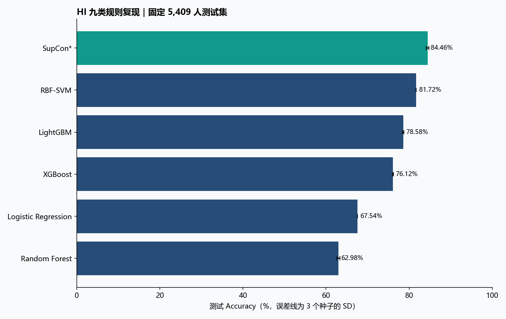

# 监督画像与 HI 十二模型：代码审查及实验报告

**阶段报告｜正式重跑尚未全部完成 · 2026-09-10**

## 核心回答

1. 两套代码均存在需要修正的问题，涉及输入协议、随机初始化、SAINT 行注意力与批次依赖、稀疏聚类距离、选参门槛和部分库接口。已修复的代码与回归证据详见附录。
2. 监督画像代码提出了结局引导的分组方法，但仍使用 HI 特征或结局，不是独立于 HI 的新健康标准。原小样本试跑不能证明“比 HI 更优”；本报告以同一测试集的早期 HI 九类和直接预测模型作对照。
3. HI 分类准确率衡量对规则的复现。它与提前预测大四表现属于两项不同实验；不能用规则拟合准确率证明新画像的健康价值。

## 数据、协议与证据

|实验|人数与划分|输入/目标|选参/重复|
|---|---|---|---|
|HI12|36,059；25,241 / 5,409 / 5,409|57 维冻结输入 → 原 HI 九类；21 维共同几何空间|验证 FMI；3 个种子，同一划分|
|监督画像|16,022；11,215 / 2,403 / 2,404|大一至大二/三 → 大四总分、HI 与变化|完整原网格；3 个选参种子、5 个最终种子|

原始数据 SHA256：`aa90b03292812ee44e326c450ca50650b08ac7dbf6f8abe78cdfb2bfa7306ce4`。所有标准化参考由训练学生估计。画像最终以训练+验证拟合；HI12 保持原训练/验证早停协议。测试结局不用于训练、选参或命名。没有把未运行模型、小样本测试或合成数据测试记作正式成绩。

分类当前有 18 组正式逐种子结果；待完成：TabPFN_v2, FT_Transformer, TabNet, SAINT, GRANDE, ResNet1D。画像待完成窗口：[2, 3]。

## HI 九类分类结果

以下为三个优化种子（42、43、44）的均值 ± 样本标准差；不是交叉验证。准确率使用类别编号逐项相等，未通过重排类别提高成绩。全部方法共享冻结输入、规则标签和学生划分，候选根据验证 FMI 选择；GRANDE 内部检查点按官方多分类验证损失选择。

|模型|Accuracy %|Macro-F1|FMI|训练人数|
|---|---|---|---|---|
|Logistic Regression|67.536 ± 0.000|0.627 ± 0.000|0.503 ± 0.000|25,241|
|Random Forest|62.981 ± 0.331|0.490 ± 0.009|0.488 ± 0.003|25,241|
|XGBoost|76.120 ± 0.126|0.676 ± 0.007|0.620 ± 0.002|25,241|
|LightGBM|78.579 ± 0.190|0.682 ± 0.004|0.659 ± 0.003|25,241|
|RBF-SVM|81.716 ± 0.000|0.742 ± 0.000|0.699 ± 0.000|25,241|
|TabPFN v2|待完成|—|—|—|
|FT-Transformer*|待完成|—|—|—|
|TabNet|待完成|—|—|—|
|SAINT*|待完成|—|—|—|
|GRANDE|待完成|—|—|—|
|1D-ResNet*|待完成|—|—|—|
|SupCon*|84.458 ± 0.315|0.803 ± 0.001|0.735 ± 0.005|25,241|

在当前已完成模型中，测试准确率最高的是 **SupCon*：84.46%**。这是该配置与固定测试集上的描述性排序，不是经过独立外部验证的普遍最优结论。最少的规则类别在测试集中只有 16 人，应同时查看各类别召回率与 Macro-F1。

星号表示项目适配实现，具体差异见代码审查说明。TabPFN v2 使用相同训练划分内的分层 10,000 人子集，单独注明监督样本预算。JC/FMI/RI 是成对分组一致性；DBI/DI 在共同 21 维空间计算，反映分组几何，不等于健康有效性。七项指标与逐学生预测均提供 CSV。

## 监督画像与早期 HI 的同任务比较

同一 16,022 人完整实测队列；每个窗口测试 2,404 人。以下均值±SD来自五个模型种子（42–46）。门槛检查簇规模、稳定性、可分配性和性别关联，不代表临床有效或已允许实际部署。

尚未完成正式结果的窗口：[2, 3]。此时不能断言新画像优于 HI。

## 交付与复现

- `HI12_汇总.csv`、`HI12_逐种子七指标.csv`、`HI12_逐学生预测.csv`、`HI12_各类别表现.csv`：分类数值与逐人核验依据。
- `监督画像_两窗口逐种子结果.csv`、`early2/3_配对Bootstrap.csv`：画像结果与条件差值区间（正式完成后提供）。
- 源代码、原始日志、模型与配置：`E:/contest/experiments/review_20260910`；修复前代码：`original_code_snapshot.zip`。
- 正式环境：`E:/contest/.venv_review_20260910/Scripts/python.exe`；依赖清单：`environment_freeze.txt`。
- 运行入口：`run_classification.py --models XGBoost,LightGBM,FT_Transformer,ResNet1D,TabNet,SAINT,GRANDE,TabPFN_v2`；`run_prospective.py`；`hi_prospective_baseline.py`。汇总入口：`build_unified_report.py --final`，正式模式会拒绝缺项结果。

尚未执行最终目录清理。

现有结果来自同一机构队列与固定划分，尚不能替代跨年度外部验证。优先补充独立时间留出和真实应用结局，才有依据讨论能否替代 HI 或用于干预。

# 附录：实现审查与复现边界

日期：2026-09-10。本文记录实现与协议审查；正式数值以本目录各实验结果及最终汇总报告为准。

## 1. 两套代码回答不同的问题

监督画像包用大一至大二/大三体测预测大四表现，训练时以大四总分、HI 和 HI 变化引导分组，预测时只输入早期特征。这是一套结局引导的画像候选方法，不是已经证明优于 HI 的新标准。默认 `raw_plus_hi` 特征及三个监督目标中的两个仍依赖 HI；不能称为独立于 HI 的健康分类体系。

HI 十二模型包学习复现 HI 九类规则。准确率反映对规则标签的拟合，不能用于证明规则的医学有效性，也不能证明模型画像优于 HI。规则直接使用全部所需观测时，标签一致率按定义为 100%；模型价值要通过提前预测、缺测场景或降低测量成本另行验证。

原画像输出主要为 800 人单种子功能试跑；扩展模型原报告包含小样本与合成数据验证，且 TabPFN、TabNet、GRANDE 没有完成正式训练。因此不能直接把“代码有实现”写成“实验已完成”。

## 2. 发现与修复

| 位置 | 问题及影响 | 修复与验证 |
|---|---|---|
| HI12 / data.py | 重建输入未与旧四模型冻结数组逐值对齐；近似复现某个模型分数不能证明协议一致 | 核验原 CSV SHA256、学生 ID 唯一性/集合、规则标签和划分；直接复用原实验的 57 维输入与 21 维几何空间。单测逐值核对三份划分 |
| FT、ResNet、原 SAINT | 创建网络后才设置种子，初始化不可复现 | 将设种子移至网络创建之前，回归测试检查初始权重 |
| SAINT | 原行注意力逐特征跨学生计算，与作者的整行展开注意力不同；预测受同批其他测试学生影响 | 改为整行注意力，推理采用 32 名固定训练学生作为上下文，屏蔽其他查询学生；多层网络检验独立/批量一致性。属于明确声明的监督适配版本 |
| GuidedSparseKMeans | 权重目标使用 BCSS/TSS，聚类距离未除以 TSS；训练加验证重拟合后不再等价 | 聚类和推理统一使用 `w/TSS`；回归测试以非单位方差输入验证 |
| sparse weights | L1 上限等于 1 且最大值并列时可违反约束 | 明确选取一个最大权重坐标，测试并列边界 |
| selection.py | 非有限指标可能进入选参评分 | 必需指标全部有限才允许候选进入可行集合 |
| 画像最终门槛 | 只看均值会掩盖个别种子小簇或失衡；未继承验证可行性 | 同时要求验证可行、最差种子簇占比/可分配性/性别关联满足门槛 |
| 画像 data.py | 未拒绝重复学生、未统一排序；无限分数未排除；浮点划分比例可偏一人 | 唯一性检查、ID 排序、有限性过滤、比例舍入 |
| 画像推理产物 | 模型之外缺少原始数据转换所需的参考统计量 | 保存 profile/HI 训练参考、X/Y scaler、特征名、窗口、配置至 preprocessing.joblib |
| repeated_split_evaluation.py | 新划分复用主划分选出的参数，主划分训练/验证学生可能进入新测试集 | 每个划分内部重新完整选参并拟合；本次主报告不把未运行的重复划分分析列为已完成结果 |
| XGBoost / LightGBM / TabNet | 原内部早停指标与外部 FMI 选参不同；LightGBM subsample 未启用采样频率 | 内部早停统一 FMI；LightGBM 设置 subsample_freq=1 |
| Torch trainer | 需要显式阻断非有限梯度 | clip_grad_norm 设置 error_if_nonfinite=True |
| 扩展运行器 | 原模型保存失败只警告，缺少重新加载检查和增量进度 | 保存失败计入运行失败；每个种子重新加载并核对预测及单样本/批量一致性；保存逐种子结果与训练记录 |
| TabPFN | 原自动版本随安装版本漂移；正式推理超过 8GB 显存 | 显式 ModelVersion.V2，保留分层 10,000 人训练预算，开启节省显存并每 256 人预测。失败及重试日志保留 |

早期 OLS 斜率仍是早期值与差分的线性组合；保留它相当于一种轨迹特征权重选择，不能描述为新增独立信息。已更正误导性代码注释。

## 3. 方法名称与复现边界

- Logistic Regression、Random Forest、RBF-SVM：使用先前完成并冻结的三个种子结果；核验输入、划分和逐学生预测后合并，避免混入其他标签协议的历史数字。
- XGBoost、LightGBM、TabNet：调用对应库；候选参数、权重平衡、早停、预算见各方法代码及 validation_candidates.csv。
- TabPFN v2：使用官方 V2 权重和 API，分层抽取 10,000 名训练学生；其训练人数与其他模型的 25,241 人不同。三个种子的变化包含抽样变化，不能只解释为初始化方差。
- FT-Transformer：数值特征 token、CLS、Transformer 的项目实现；采用 PyTorch GELU/PreNorm，非作者论文全部结构与配方的逐项复刻。
- SAINT：整行注意力、监督分类及固定训练上下文版本；未执行原论文对比预训练，数值 tokenizer 与原完整实现存在差异。报告必须保留此标注。
- GRANDE：使用作者当前 PyTorch 0.2.0 实现；外层候选按验证 FMI，官方多分类内部早停按验证损失。与其余模型早停规则并非完全一致，不把它称为统一 FMI 检查点实验。
- 1D-ResNet：对排列后的 57 维表格特征做一维卷积的项目基线；不等同于严格按年组织的时间序列 ResNet。
- SupCon：复用已审查的监督对比损失、分类损失与中心约束组合；不是仅含原论文对比损失的消融。

本实验比较的是明确记录的实现和预算；两候选的小网格不代表穷尽每个模型的最优性能。不要写“某算法理论上/普遍优于另一个算法”。

## 4. 公平对照与统计解释

画像实验仅纳入四年真实观测且全部原始指标和总分有限的 16,022 人，训练/验证/测试为 11,215/2,403/2,404。HI12 使用原 36,059 人、25,241/5,409/5,409 划分。两任务测试人群、输入可用时间和目标不同，指标不能横向排序。

为画像实验新增 EARLY_HI9_RULE：在同一学生划分上，仅用早期最新总分及早期 HI 斜率生成九类；训练加验证学生估计每类大四结局均值，测试学生只按早期标签分配。该基线和画像方法使用相同训练参考及测试结局，避免拿四年完整 HI 分类去冒充早期预测。

另保留直接预测 Logistic/Ridge、HGB 基线。画像若优于 HI 九类但落后于直接预测，应表述为“分组表达更细致/结局区分改善，预测代价仍存在”，不能宣称全面替代 HI。

画像的可行性门槛是研究操作标准，不是经临床验证的部署许可。簇数、规模、稳定性、性别关联、可分配性及结局预测需共同报告。大样本 ANOVA/KW 显著性不等于实际改善；主要看效应量、误差、AUC 与配对差值。

三个或五个模型种子均在同一学生划分上运行；均值±SD 不等同于跨人群泛化区间。后续学生 bootstrap 区间仅刻画给定模型/划分下的测试抽样不确定性。重叠重复留出也不能当成独立重复实验，且多方法比较若未校正不可声称显著最优。

## 5. 主要方法来源

- [Outcome-guided sparse K-means，作者论文](https://academic.oup.com/jrsssc/article/71/2/352/7033987)：指导变量与稀疏聚类联合目标。
- [Supervised Fuzzy Partitioning，作者论文](https://arxiv.org/abs/1806.06124)：结局损失与隶属度、特征权重熵正则。
- [SAINT 作者实现](https://github.com/somepago/saint)：核对行/列注意力及完整训练方案。
- [FT-Transformer 作者实现](https://github.com/yandex-research/rtdl-revisiting-models)：核对项目适配与原配方差异。
- [TabPFN 官方实现](https://github.com/PriorLabs/TabPFN)：显式版本选择与推理设置。
- [GRANDE 作者实现](https://github.com/s-marton/GRANDE)：当前 PyTorch 版本参数、内部早停行为。

## 6. 复现及保留规则

修复前源代码存于 original_code_snapshot.zip。正式重跑输出独立存于 hi9_12models 与 prospective，原结果未覆盖。新增依赖安装在 E:/contest/.venv_review_20260910；Python 3.13 下 autogluon 两个纯 Python 辅助包采用忽略 Requires-Python 的安装适配，导入/正式执行是否成功分别核验，不宣称这是库官方支持的环境。

运行入口：run_classification.py、run_prospective.py、hi_prospective_baseline.py。分类脚本按模型完成状态恢复；画像入口完整运行默认网格。缓存清理须记录实际路径及字节数，保留原始数据、可复现代码、训练环境、有效模型、审计日志和历史成果。
